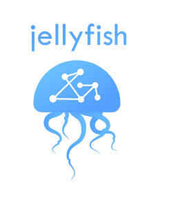

A Jellyfish EEG jelek rögzítését, feldolgozását és vizualizációját teszi lehetővé
okostelefonon. Az alkalmazás Ionic illetve Angular keretrendszerekkel lett megvalósítva, így
egyaránt használható Android illetve iOS operációs rendszer alatt. Elsősorban Emotiv
készülékekkel használható (EPOC+ és Insight), azonban más termékcsaláddal való
kompatibilitás megvalósítása is tervben van a jövőben. Az EEG készülék Bluetooth
kommunikációval csatlakozik az adott telefonra, mely pontos és gyors adatátvitelt tesz lehetővé
bizonyos hatótávolságon belül. Az előző fejezetben említett alkalmazásoktól főként a
felhasználók kezelésével és az adatok tárolásával tér el. Az adatok tárolása a felhőben történik,
így biztosítva, hogy más felhasználók is szabadon felhasználhassák az adatokat különböző
projektekben a világ bármely részén. 

## Letöltés | [ Jellyfish.apk ](https://github.com/valentin-vio-dev/jellyfish/tree/master/apk)
 
